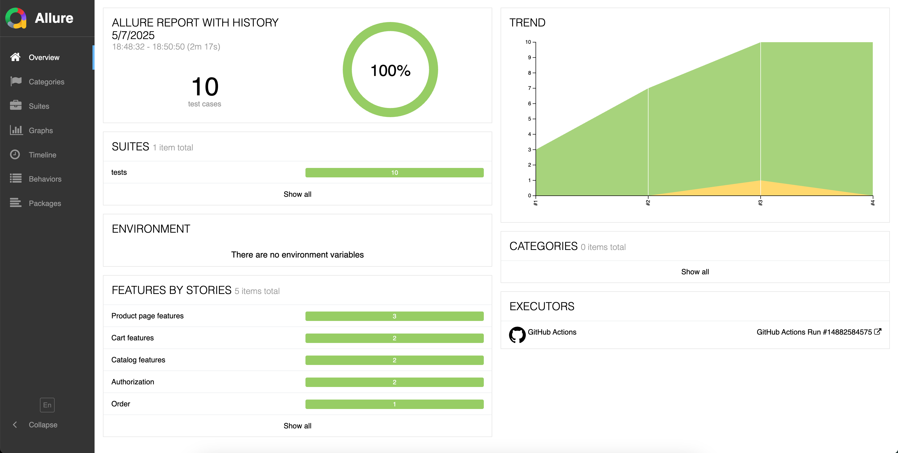
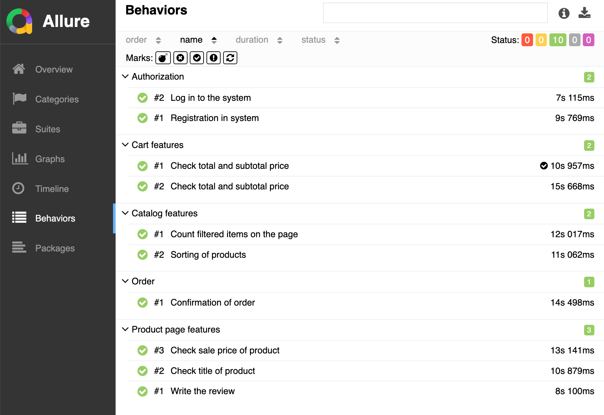
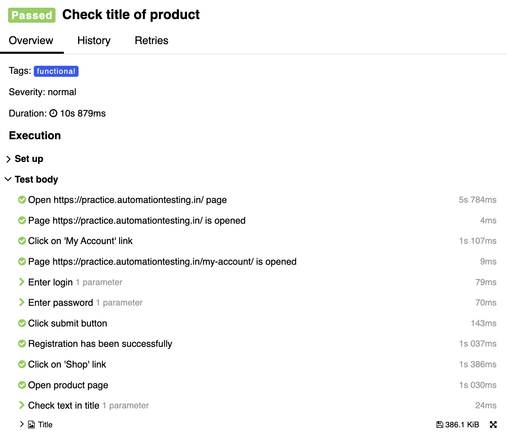

# 
Project of automation UI testing of online bookstore for QA engineers practice

## :feet: Contents
+ [Project goal](#dart-project-goal)
+ [Technologies and tools](#gear-technologies-and-tools)
+ [List of implemented tests](#white_check_mark-list-of-implemented-tests)
+ [GitHub Actions CI](#rocket-github-actions-ci)
+ [Test results in Allure Report](#bar_chart-test-results-in-allure-report)
+ [Example of passing the test](#eyes-example-of-passing-the-test)

# :dart: Project goal
Diploma work on test automation course. The goal of this project is demonstration of skills in automation testing

# :gear: Technologies and tools

# :white_check_mark: List of implemented tests
+ User registration in the system
+ User authorization
+ Checking the conformity of product information
+ Writing a review of the product
+ Adding a product to the cart
+ Checking the subtotal and total cost of products in the cart
+ Actions in the cart (changing the quantity of products, deleting, recalculating the cost)
+ Placing an order

# :rocket: GitHub Actions CI
Tests are launched using GitHub Actions. The trigger for launching is workflow dispatch where you can choose a type of tests

# :bar_chart: Test results in Allure Report
Allure report with the history of previous launches is automatically generated after passing the tests

Result of running tests

List of the tests

Passing the test

# :eyes: Example of passing the test
